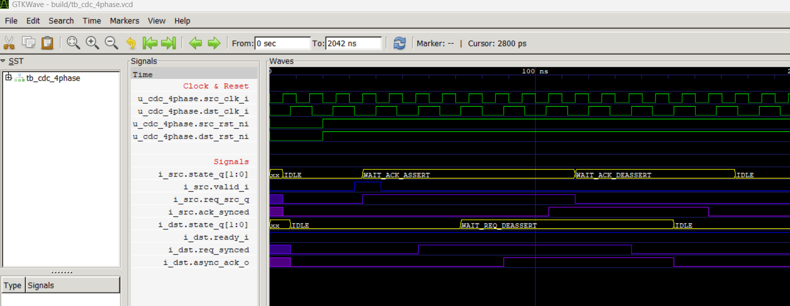

# Project Template for Verilog and SystemVerilog

This project is a template for projects using Verilog and SystemVerilog languages. 

It utilizes open-source tools like iverilog and gtkwave for compilation, simulation, and waveform viewing, making it convenient to develop projects (such as VSCode).



## Directory Structure

```
.project-root
├── .vscode/
│ └── tasks.json
├── build/
│ └── (compiled outputs and intermediate files)
├── GTKWave/
│ ├── set_wave.tcl
| └—— file filters 
├── src/
│ ├── module1.sv
│ └── module2.sv
├── testbench/
│ ├── tb_module.sv
│ └── (other testbench files)
└── Makefile
```
# Usage
## Install Required Tools
  - iverilog
  - gtkwave

## Run Simulation and View Waveforms

Run vscode tasks or run the following command in the terminal:
```bash
make waveform
```

# Customization
You can modify the Makefile in the root directory, as well as the Tcl scripts and signal-to-string mapping files (file filter) in the GTKWave folder.

# References
Tcl scripts referenced from: 

https://gist.github.com/carlosedp/97188d9b0749c9faf99f8a79df5a3db6

Demo source referenced from: 

https://github.com/pulp-platform/common_cells/blob/master/src/cdc_4phase.sv